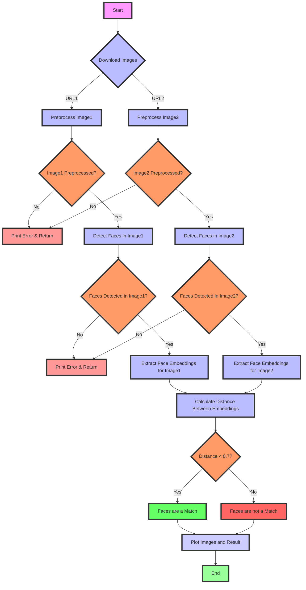
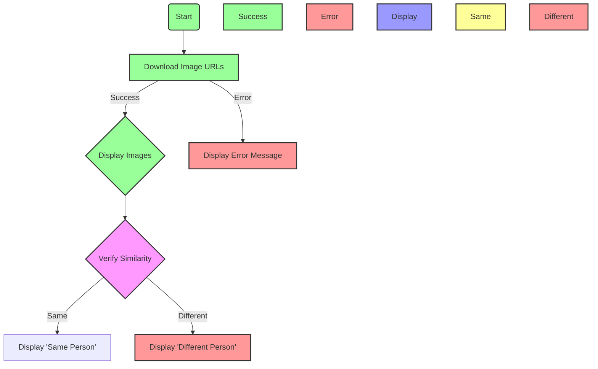
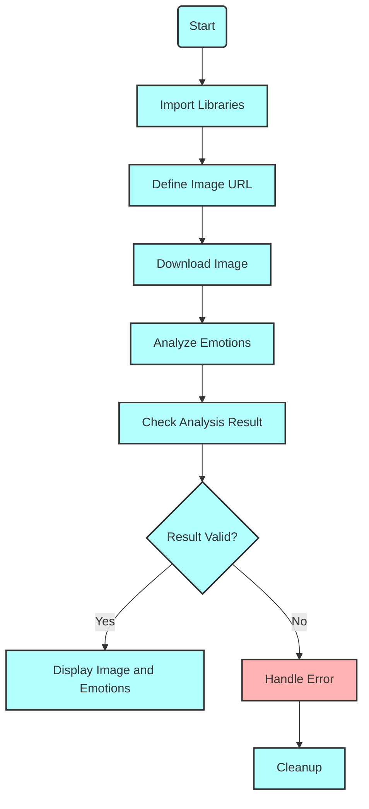
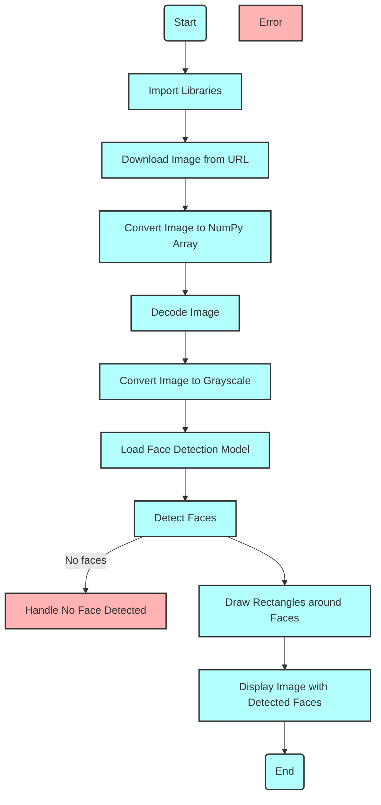

[](https://github.com/serengil/deepface)
[](https://github.com/opencv/opencv-python)
[](https://github.com/matplotlib/matplotlib)
[](https://github.com/psf/requests)
[](https://github.com/python-pillow/Pillow)
[](https://github.com/timesler/facenet-pytorch)
[](https://github.com/pytorch/vision)
[](https://github.com/pytorch/pytorch)
[](https://github.com/numpy/numpy)
[](https://github.com/scikit-learn/scikit-learn)
[](https://github.com/serengil/deepface)


---
# DeepFace Recognition

---
[](https://github.com/rubypoddar/DeepFace-Recognition)

---
[](https://github.com/rubypoddar/DeepFace-Recognition)
[](https://github.com/rubypoddar/DeepFace-Recognition)
[](https://github.com/rubypoddar/DeepFace-Recognition)
[](https://github.com/rubypoddar/DeepFace-Recognition)
[](https://github.com/rubypoddar/DeepFace-Recognition)
[](https://github.com/rubypoddar/DeepFace-Recognition)

---
## Introduction

Welcome to the DeepFace Recognition project repository. This project utilizes advanced computer vision techniques and deep learning models to perform accurate face detection, emotion analysis, and facial recognition tasks. It combines the power of MTCNN for face detection, deep embeddings from InceptionResnetV1 for facial recognition, and real-time emotion analysis to provide comprehensive insights into facial data.

## Key Features

- **Face Detection:** Utilizes MTCNN for robust and efficient face detection in images.
  
- **Emotion Analysis:** Provides real-time analysis of facial expressions to detect emotions such as happiness, sadness, anger, surprise, and more.
  
- **Facial Recognition:** Uses InceptionResnetV1 pretrained on VGGFace2 dataset to generate embeddings for accurate facial recognition tasks.
  
- **Distance Measurement:** Calculates Euclidean distance between face embeddings to determine similarity and match faces.
  
- **Real-time Processing:** Capable of performing face detection and emotion analysis in real-time using efficient algorithms and GPU acceleration.

---

---

# Face Recognition with MTCNN and InceptionResnetV1


## Overview

This project demonstrates how to perform face recognition using MTCNN and InceptionResnetV1 models from the `facenet-pytorch` library. The program downloads images from given URLs, processes them to detect faces, extracts facial embeddings, and compares the embeddings to determine if the faces in the images match.


## Key Features

- **Image Downloading**: Download images from URLs.
- **Face Detection**: Detect faces in images using MTCNN.
- **Face Embedding**: Extract facial embeddings using InceptionResnetV1.
- **Face Comparison**: Compare facial embeddings to determine if faces match.
- **Visualization**: Display images with match results.

## Dependencies

- [Python 3.8+](https://www.python.org/downloads/)
- [OpenCV 4.5.3](https://opencv.org/releases/)
- [Requests 2.25.1](https://pypi.org/project/requests/)
- [Pillow 8.2.0](https://python-pillow.org/)
- [NumPy 1.21.0](https://numpy.org/)
- [facenet_pytorch 2.5.2](https://github.com/timesler/facenet-pytorch)
- [torchvision 0.10.0](https://pypi.org/project/torchvision/)
- [Matplotlib 3.4.2](https://matplotlib.org/)

  # Code Explanation 

```python
import cv2
import requests
from io import BytesIO
from PIL import Image
import numpy as np
from facenet_pytorch import MTCNN, InceptionResnetV1
from torchvision import transforms
import torch
import matplotlib.pyplot as plt
```
1. **Importing Libraries**:
    - `cv2`: For image processing using OpenCV.
    - `requests`: To handle HTTP requests for downloading images.
    - `BytesIO`: To handle byte data streams.
    - `PIL.Image`: For image manipulation.
    - `numpy`: For numerical operations.
    - `facenet_pytorch.MTCNN` and `InceptionResnetV1`: For face detection and face recognition models.
    - `torchvision.transforms`: For image transformation utilities.
    - `torch`: For tensor operations and handling the device (CPU/GPU).
    - `matplotlib.pyplot`: For plotting images.

```python
# Initialize MTCNN and InceptionResnetV1 models
device = torch.device('cuda' if torch.cuda.is_available() else 'cpu')
mtcnn = MTCNN(keep_all=True, device=device)
resnet = InceptionResnetV1(pretrained='vggface2').eval().to(device)
```
2. **Model Initialization**:
    - `device`: Checks if CUDA (GPU) is available; if not, falls back to CPU.
    - `mtcnn`: Initializes the MTCNN model for face detection, set to detect all faces (`keep_all=True`).
    - `resnet`: Initializes the InceptionResnetV1 model for face recognition, pretrained on the `vggface2` dataset, set to evaluation mode (`eval()`), and moved to the specified device (`to(device)`).

```python
# Function to download and preprocess images from URLs
def preprocess_image_from_url(image_url):
    try:
        response = requests.get(image_url)
        if response.status_code != 200:
            print(f"Failed to download image from URL: {image_url}")
            return None
        
        # Convert image to PIL Image
        img = Image.open(BytesIO(response.content))
        
        # Convert PIL Image to numpy array and BGR format (for OpenCV compatibility)
        img_rgb = cv2.cvtColor(np.array(img), cv2.COLOR_RGB2BGR)
        
        return img_rgb

    except requests.exceptions.RequestException as e:
        print(f"Error downloading the image: {str(e)}")
        return None
    except Exception as e:
        print(f"Error occurred: {str(e)}")
        return None
```
3. **Image Download and Preprocessing**:
    - `preprocess_image_from_url`: Function to download and preprocess images from a given URL.
    - `response = requests.get(image_url)`: Sends a GET request to the image URL.
    - `if response.status_code != 200`: Checks if the request was successful.
    - `img = Image.open(BytesIO(response.content))`: Converts the downloaded content to a PIL Image.
    - `img_rgb = cv2.cvtColor(np.array(img), cv2.COLOR_RGB2BGR)`: Converts the PIL Image to a NumPy array and then to BGR format (for OpenCV compatibility).
    - Returns the preprocessed image or `None` if there was an error.

```python
# Function to recognize faces using facenet-pytorch
def recognize_faces(url1, url2):
    # Preprocess images from URLs
    img1 = preprocess_image_from_url(url1)
    img2 = preprocess_image_from_url(url2)

    if img1 is None or img2 is None:
        return

    # Detect faces and get embeddings
    def get_embeddings(img):
        boxes, _ = mtcnn.detect(img)
        if boxes is not None:
            faces = []
            for box in boxes:
                x1, y1, x2, y2 = map(int, box)
                face = img[y1:y2, x1:x2]
                face = cv2.cvtColor(face, cv2.COLOR_BGR2RGB)  # Convert BGR to RGB
                face = Image.fromarray(face)
                face_tensor = transforms.functional.to_tensor(face).unsqueeze(0).to(device)
                faces.append(face_tensor)
            if faces:
                embeddings = resnet(torch.cat(faces)).detach().cpu().numpy()
                return embeddings
        return None

    embeddings1 = get_embeddings(img1)
    embeddings2 = get_embeddings(img2)

    if embeddings1 is None or embeddings2 is None:
        print("No faces detected in one of the images.")
        return

    # Compare embeddings to recognize faces
    distance = np.linalg.norm(embeddings1[0] - embeddings2[0])
    print(f"Distance between faces: {distance}")
    if distance < 0.7:
        match_result = "Faces are a match."
    else:
        match_result = "Faces are not a match."

    # Plot images and match result
    fig, ax = plt.subplots(1, 2, figsize=(10, 5))

    ax[0].imshow(cv2.cvtColor(img1, cv2.COLOR_BGR2RGB))
    ax[0].set_title('Image 1')
    ax[0].axis('off')

    ax[1].imshow(cv2.cvtColor(img2, cv2.COLOR_BGR2RGB))
    ax[1].set_title('Image 2')
    ax[1].axis('off')

    fig.suptitle(match_result, fontsize=16)
    plt.tight_layout()
    plt.show()

# Example usage with the provided image URLs
url1 = 'https://i.pinimg.com/736x/ef/b2/b7/efb2b77b15bd1de56c0b42845e9013cf.jpg'
url2 = 'https://i.pinimg.com/564x/94/48/78/944878cfa49fe275e13c8e0ae0c1f129.jpg'
recognize_faces(url1, url2)
```
4. **Face Recognition Function**:
    - `recognize_faces`: Main function to recognize faces from two image URLs.
    - `img1 = preprocess_image_from_url(url1)`, `img2 = preprocess_image_from_url(url2)`: Preprocesses the images from the provided URLs.
    - `if img1 is None or img2 is None`: Checks if either of the images failed to download or preprocess.
    
5. **Face Embedding Function**:
    - `get_embeddings`: Function to detect faces and get their embeddings.
    - `boxes, _ = mtcnn.detect(img)`: Detects faces in the image.
    - `for box in boxes`: Iterates over each detected face.
    - `face = img[y1:y2, x1:x2]`: Extracts the face region from the image.
    - `face_tensor = transforms.functional.to_tensor(face).unsqueeze(0).to(device)`: Converts the face region to a tensor and moves it to the specified device.
    - `embeddings = resnet(torch.cat(faces)).detach().cpu().numpy()`: Gets the embeddings for the faces.

6. **Embedding Comparison**:
    - `embeddings1 = get_embeddings(img1)`, `embeddings2 = get_embeddings(img2)`: Gets the embeddings for both images.
    - `if embeddings1 is None or embeddings2 is None`: Checks if faces were detected in both images.
    - `distance = np.linalg.norm(embeddings1[0] - embeddings2[0])`: Calculates the Euclidean distance between the embeddings of the first face in each image.
    - `if distance < 0.7`: Checks if the distance is below a threshold (0.7) to determine if the faces are a match.

7. **Plotting Results**:
    - `fig, ax = plt.subplots(1, 2, figsize=(10, 5))`: Creates a subplot for displaying the images.
    - `ax[0].imshow(cv2.cvtColor(img1, cv2.COLOR_BGR2RGB))`, `ax[1].imshow(cv2.cvtColor(img2, cv2.COLOR_BGR2RGB))`: Plots the images.
    - `fig.suptitle(match_result, fontsize=16)`: Adds a title indicating the match result.

8. **Example Usage**:
    - Provides example image URLs and calls the `recognize_faces` function with these URLs to demonstrate face recognition.

---





## API Reference

### Download and Preprocess Image

#### `preprocess_image_from_url(image_url)`

Downloads an image from the provided URL, converts it to a PIL Image, and then to a numpy array in BGR format (compatible with OpenCV).

```python
def preprocess_image_from_url(image_url):
    # Your implementation here
```

| Parameter  | Type     | Description                             |
| :--------- | :------- | :-------------------------------------- |
| `image_url`| `string` | **Required**. URL of the image to fetch |

**Returns**: A numpy array of the image in BGR format if successful, otherwise `None`.

### Recognize Faces

#### `recognize_faces(url1, url2)`

Downloads and preprocesses images from the provided URLs, detects faces, extracts embeddings, and compares them to determine if the faces match.

```python
def recognize_faces(url1, url2):
    # Your implementation here
```

| Parameter | Type     | Description                            |
| :-------- | :------- | :------------------------------------- |
| `url1`    | `string` | **Required**. URL of the first image   |
| `url2`    | `string` | **Required**. URL of the second image  |

**Returns**: None. The function prints the result of the face match and displays the images with the match result using matplotlib.

### Internal Helper Function

#### `get_embeddings(img)`

Detects faces in the given image, extracts their embeddings using the InceptionResnetV1 model, and returns the embeddings.

```python
def get_embeddings(img):
    # Your implementation here
```

| Parameter | Type     | Description                      |
| :-------- | :------- | :------------------------------- |
| `img`     | `numpy array` | **Required**. Image in BGR format |

**Returns**: A numpy array of face embeddings if faces are detected, otherwise `None`.

### Example Usage

#### Recognize Faces Example

```python
url1 = 'https://i.pinimg.com/736x/ef/b2/b7/efb2b77b15bd1de56c0b42845e9013cf.jpg'
url2 = 'https://i.pinimg.com/564x/94/48/78/944878cfa49fe275e13c8e0ae0c1f129.jpg'
recognize_faces(url1, url2)
```

**Description**: Downloads images from the provided URLs, preprocesses them, detects faces, extracts embeddings, compares the embeddings, and prints whether the faces match.

---

## **Face Verification using DeepFace and OpenCV**

### Introduction

This project demonstrates a face verification system using the DeepFace library and OpenCV. The system downloads images from specified URLs, saves them locally, and then verifies if the images are of the same person. By leveraging DeepFace's powerful facial recognition capabilities, the project performs an efficient and accurate comparison between the two faces. The results are visualized using Matplotlib, providing a clear and intuitive display of whether the faces match. This project showcases the integration of various libraries and APIs to achieve a practical application of face verification.


### Key Features

1. **Image Download and Storage**
   - Downloads images from URLs and saves them locally for processing.

2. **Image Verification**
   - Utilizes DeepFace to verify if two images contain the same person.
   - Displays the comparison result visually with labeled outputs ("Same Person" or "Different Person").

3. **Visual Representation**
   - Uses matplotlib and OpenCV to display images side by side for visual comparison.
   - Enhances readability with annotations indicating the verification result.

4. **Error Handling**
   - Includes robust error handling for image download failures and reading errors using exception handling.

5. **Dependencies**
   - Utilizes libraries such as DeepFace, OpenCV, matplotlib, requests, PIL, and os for image processing and verification tasks.

6. **Ease of Use**
   - Provides clear functions (`download_image` and `verify`) for straightforward implementation and usage.

7. **Compatibility**
   - Supports both local and remote image processing, accommodating various use cases.


### Dependency 

1. **DeepFace**:
   

2. **OpenCV**:
   

3. **Matplotlib**:
   

4. **Requests**:
   

5. **Pillow**:
   


### Step-by-Step Explanation of Code

```python
from deepface import DeepFace
import cv2
import matplotlib.pyplot as plt
import requests
from io import BytesIO
from PIL import Image
import os
```

1. **Imports**: 
   - `deepface`: Imports the DeepFace library for facial recognition tasks.
   - `cv2`: Imports OpenCV for image processing tasks.
   - `matplotlib.pyplot as plt`: Imports Matplotlib for plotting images and results.
   - `requests`: Imports the Requests library for making HTTP requests to download images.
   - `BytesIO` from `io`: Imports BytesIO for handling binary data of images.
   - `Image` from `PIL`: Imports Image from the Pillow library to work with images.
   - `os`: Imports the os module for operating system dependent functionality like file operations.

```python
# Function to download and save image from URL
def download_image(url, save_path):
    try:
        response = requests.get(url)
        if response.status_code == 200:
            # Create directory if it doesn't exist
            os.makedirs(os.path.dirname(save_path), exist_ok=True)
            image = Image.open(BytesIO(response.content))
            image.save(save_path)
            return True
        else:
            print(f"Failed to download image from {url}. Status code: {response.status_code}")
            return False
    except Exception as e:
        print(f"Exception occurred while downloading image from {url}: {str(e)}")
        return False
```

2. **download_image Function**:
   - `download_image(url, save_path)`: Downloads an image from the provided `url` and saves it to `save_path`.
   - Checks if the HTTP response status code is 200 (successful).
   - Creates the directory structure if it doesn't exist using `os.makedirs`.
   - Uses `BytesIO` to handle the response content as binary data and `Image.open` from Pillow to open and save the image.
   - Returns `True` if the image is downloaded and saved successfully; otherwise, prints an error message and returns `False`.

```python
# URLs of the images
url1 = 'https://i.pinimg.com/736x/ef/b2/b7/efb2b77b15bd1de56c0b42845e9013cf.jpg'
url2 = 'https://i.pinimg.com/736x/62/54/de/6254dec95b842ded0f109f478c68d378.jpg'

# File paths to save images locally
img_dir = 'img'
img1_path = os.path.join(img_dir, 'img_from_url1.jpg')
img2_path = os.path.join(img_dir, 'img_from_url2.jpg')
```

3. **Image URLs and Paths**:
   - Defines `url1` and `url2` with URLs of images to download.
   - Specifies local paths (`img1_path` and `img2_path`) where the downloaded images will be saved, using `os.path.join` to create paths relative to the `img_dir` directory.

```python
# Download images from URLs
success1 = download_image(url1, img1_path)
success2 = download_image(url2, img2_path)
```

4. **Downloading Images**:
   - Calls `download_image` function for `url1` and `url2`, storing success status (`True` or `False`) in `success1` and `success2`.

```python
if success1 and success2:
    # Function to verify if images are of the same person
    def verify(img1_path, img2_path):
        try:
            img1 = cv2.imread(img1_path)
            img2 = cv2.imread(img2_path)
            
            if img1 is None:
                print(f"Failed to read image from {img1_path}")
                return
            if img2 is None:
                print(f"Failed to read image from {img2_path}")
                return
            
            fig, axs = plt.subplots(1, 2, figsize=(12, 6))
            
            axs[0].imshow(cv2.cvtColor(img1, cv2.COLOR_BGR2RGB))
            axs[0].set_title('Image 1')
            axs[0].axis('off')
            
            axs[1].imshow(cv2.cvtColor(img2, cv2.COLOR_BGR2RGB))
            axs[1].set_title('Image 2')
            axs[1].axis('off')
            
            # Verify similarity
            output = DeepFace.verify(img1_path, img2_path)
            verification = output['verified']
            
            if verification:
                axs[0].text(10, 10, 'Same Person', color='green', fontsize=12, fontweight='bold', bbox=dict(facecolor='white', alpha=0.8))
                axs[1].text(10, 10, 'Same Person', color='green', fontsize=12, fontweight='bold', bbox=dict(facecolor='white', alpha=0.8))
            else:
                axs[0].text(10, 10, 'Different Person', color='red', fontsize=12, fontweight='bold', bbox=dict(facecolor='white', alpha=0.8))
                axs[1].text(10, 10, 'Different Person', color='red', fontsize=12, fontweight='bold', bbox=dict(facecolor='white', alpha=0.8))
            
            plt.tight_layout()
            plt.show()
        
        except Exception as e:
            print(f"Exception occurred during verification: {str(e)}")

    # Verify if images are of the same person
    verify(img1_path, img2_path)
else:
    print("Failed to download one or both of the images. Check the URLs and try again.")
```
---





###  Reference

#### Download Image from URL

Downloads an image from a specified URL and saves it locally.

- **URL**

  ```
  GET /api/download_image
  ```

- **Parameters**

  | Parameter | Type     | Description                |
  | :-------- | :------- | :------------------------- |
  | `url`     | `string` | **Required**. URL of the image to download |

- **Response**

  Returns a JSON object indicating success or failure of the download.

  ```json
  {
    "success": true,
    "message": "Image downloaded successfully"
  }
  ```

  ```json
  {
    "success": false,
    "message": "Failed to download image. Check the URL and try again."
  }
  ```

#### Verify Similarity of Images

Verifies if two images are of the same person using DeepFace.

- **URL**

  ```
  GET /api/verify_similarity
  ```

- **Parameters**

  | Parameter  | Type     | Description                          |
  | :--------- | :------- | :----------------------------------- |
  | `image1_path` | `string` | **Required**. Local path of the first image |
  | `image2_path` | `string` | **Required**. Local path of the second image |

- **Response**

  Returns a JSON object indicating whether the images are of the same person.

  ```json
  {
    "verified": true,
    "message": "Images are of the same person"
  }
  ```

  ```json
  {
    "verified": false,
    "message": "Images are of different persons"
  }
  ```

#### Example Usage

```python
import requests

# Download image from URL
def download_image(url):
    response = requests.get(f'/api/download_image?url={url}')
    return response.json()

# Verify similarity of downloaded images
def verify_similarity(image1_path, image2_path):
    response = requests.get(f'/api/verify_similarity?image1_path={image1_path}&image2_path={image2_path}')
    return response.json()

# Example usage
url1 = 'https://example.com/image1.jpg'
url2 = 'https://example.com/image2.jpg'

# Download images
download_result1 = download_image(url1)
download_result2 = download_image(url2)

if download_result1['success'] and download_result2['success']:
    # Perform verification
    verify_result = verify_similarity('/path/to/image1.jpg', '/path/to/image2.jpg')
    print(verify_result)
else:
    print("Failed to download one or both of the images. Check the URLs and try again.")
```

This API reference outlines the endpoints, parameters, and expected responses for downloading and verifying images based on your provided code structure. Adjust the URLs, parameters, and response messages as per your specific implementation details and requirements

---


## Emotion Detection using DeepFace

This  utilizes the DeepFace library to perform emotion detection on images fetched from a specified URL. It begins by downloading the image using urllib.request and then employs DeepFace's analyze function to detect emotions such as happiness, sadness, anger, and others present in the image. The results are displayed using matplotlib, where the original image is shown alongside annotations highlighting each detected emotion and their corresponding confidence scores. Error handling ensures robustness during image analysis, and the temporary image file is automatically removed after processing. This script serves as a practical tool for analyzing emotions in images with ease and accuracy.


1. **Image Download**: The script downloads an image from a specified URL using `urllib.request` and saves it as `temp.jpg`.

2. **Emotion Analysis**: It utilizes DeepFace's `analyze` function to perform emotion detection on the downloaded image. The analysis focuses on detecting various emotions present in the image.

3. **Result Processing**: After analyzing the image, the script checks if valid results are obtained. It retrieves emotions detected from the first result, assuming it contains the desired data structure.

4. **Visualization**: Using `matplotlib`, the script visualizes the original image along with annotations for each detected emotion. Annotations include the type of emotion detected (e.g., happiness, sadness) and their corresponding confidence scores.

5. **Error Handling**: The script includes error handling to manage exceptions that may occur during image analysis or visualization.

6. **Cleanup**: Finally, the temporary image file (`temp.jpg`) is removed to maintain cleanliness after the script execution.

### How to Use

`To use this script:`
- Replace `image_url` with the URL of the image you want to analyze.
- Run the script to see the emotions detected in the image and their respective visual annotations.

## Dependencies

[](https://github.com/serengil/deepface)
[](https://github.com/matplotlib/matplotlib)
[](https://github.com/numpy/numpy)
[](https://github.com/python-pillow/Pillow)
[](https://docs.python.org/3/library/urllib.html)
[](https://www.python.org/)


1. **Imports:**
   ```python
   from deepface import DeepFace
   import matplotlib.pyplot as plt
   import urllib.request
   from PIL import Image
   import numpy as np
   ```
   - **DeepFace:** Imports the DeepFace library for facial analysis.
   - **matplotlib.pyplot:** Imports pyplot module from Matplotlib for plotting.
   - **urllib.request:** Allows fetching data from URLs.
   - **PIL.Image:** Imports the Image class from the Python Imaging Library (Pillow) for image manipulation.
   - **numpy:** Imports the NumPy library for numerical operations.

2. **Image URL:**
   ```python
   image_url = 'https://i.pinimg.com/736x/ec/6b/76/ec6b76ce531990ccc6bad65d390fcb92.jpg'
   ```
   - Defines the URL of the image to be analyzed.

3. **Downloading Image:**
   ```python
   with urllib.request.urlopen(image_url) as url:
       with open('temp.jpg', 'wb') as f:
           f.write(url.read())
   ```
   - Uses `urllib.request.urlopen` to download the image from `image_url` and saves it as `'temp.jpg'`.

4. **Emotion Analysis:**
   ```python
   result = DeepFace.analyze(img_path='temp.jpg', actions=['emotion'])
   ```
   - Calls `DeepFace.analyze` with the image path (`'temp.jpg'`) and specifies `'emotion'` as the action to perform. This analyzes the emotions present in the image.

5. **Handling Analysis Result:**
   ```python
   if isinstance(result, list) and len(result) > 0:
       first_result = result[0]
       if 'emotion' in first_result:
           emotions = first_result['emotion']
           # Print detected emotions
           for emotion, value in emotions.items():
               print(f"{emotion}: {value}")
   ```
   - Checks if `result` is a non-empty list and retrieves the first element (`first_result`). If `'emotion'` is present in `first_result`, it prints out each detected emotion and its corresponding value.

6. **Displaying Image and Annotations:**
   ```python
   img = Image.open('temp.jpg')
   img = np.array(img)

   plt.figure(figsize=(8, 6))
   plt.imshow(img)

   for emotion, value in emotions.items():
       plt.text(10, 20 + list(emotions.keys()).index(emotion) * 20, f'{emotion}: {value:.2f}', fontsize=12, color='red', weight='bold')

   plt.axis('off')
   plt.title('Emotions Detected')
   plt.show()
   ```
   - Opens `'temp.jpg'` using PIL and converts it into a NumPy array (`img`).
   - Sets up a Matplotlib figure (`plt.figure(figsize=(8, 6))`) and displays the image (`plt.imshow(img)`).
   - Adds text annotations (`plt.text`) for each detected emotion with its value.
   - Turns off axis labels (`plt.axis('off')`) and sets the title (`plt.title('Emotions Detected')`) before showing the plot (`plt.show()`).

7. **Error Handling and Cleanup:**
   ```python
   except Exception as e:
       print(f"Error analyzing face: {e}")

   # Clean up: Remove temporary image file
   import os
   os.remove('temp.jpg')
   ```
   - Catches and prints any exceptions that occur during image analysis.
   - Removes the temporary image file (`'temp.jpg'`) after processing to clean up resources.

---


---

## Emotion Detection API Reference

#### Analyze Emotions in an Image

```http
  POST /api/analyze/emotion
```

| Parameter  | Type     | Description                |
| :--------- | :------- | :------------------------- |
| `image_url`| `string` | **Required**. URL of the image to analyze. |
| `face_detection` | `boolean` | *Optional*. Whether to perform face detection before analyzing emotions. Default is `true`. |
| `face_embedding` | `boolean` | *Optional*. Whether to extract face embeddings for the detected face. Default is `false`. |
| `emotion_labels` | `array` of `string` | *Optional*. List of specific emotions to detect (e.g., `["happy", "sad"]`). Default is to detect all available emotions. |

#### Response

On success:

```json
{
  "emotions": {
    "happy": 0.75,
    "sad": 0.12,
    "angry": 0.08,
    "neutral": 0.05
  },
  "face_detected": true,
  "face_embedding": [0.25, -0.18, ...]
}
```

- **`emotions`**: Dictionary containing detected emotions and their confidence scores.
- **`face_detected`**: Boolean indicating if a face was detected in the image.
- **`face_embedding`**: Array of numbers representing the face embedding if `face_embedding` is set to `true`.

#### Example

```bash
curl -X POST -H "Content-Type: application/json" -d '{"image_url": "https://example.com/image.jpg", "face_detection": true, "face_embedding": false, "emotion_labels": ["happy", "sad"]}' https://api.deepface.com/analyze/emotion
```

#### Success Response

```json
HTTP/1.1 200 OK
Content-Type: application/json

{
  "emotions": {
    "happy": 0.75,
    "sad": 0.12,
    "angry": 0.08,
    "neutral": 0.05
  },
  "face_detected": true
}
```

#### Error Responses

- **Invalid image_url**
  - **Code:** 400 Bad Request
  - **Content:**
    ```json
    {
      "error": "Invalid image_url provided"
    }
    ```

- **Internal Server Error**
  - **Code:** 500 Internal Server Error
  - **Content:**
    ```json
    {
      "error": "An unexpected error occurred"
    }
    ```

---

This extended API reference  includes additional parameters (`face_detection`, `face_embedding`, `emotion_labels`) and their descriptions, enhancing the flexibility and functionality of the emotion detection API. Adjust the details according to your specific implementation and requirements.


---

# Face Detection from URL using OpenCV

This Python script `display_detected_face_from_url` illustrates how to download an image from a specified URL, detect faces using OpenCV's Haar Cascade classifier, and visualize the detected faces by drawing rectangles around them.

## Features

- Downloads an image from a given URL.
- Detects faces in the downloaded image using OpenCV's Haar Cascade classifier.
- Draws rectangles around detected faces.
- Displays the image with detected faces using OpenCV's GUI capabilities.


1. **Image Download and Conversion**: Downloads an image from a given URL and converts it into a format suitable for processing using OpenCV and NumPy.

2. **Face Detection**: Utilizes the Haar Cascade classifier from OpenCV to detect faces in the downloaded image. The classifier is applied to the grayscale version of the image.

3. **Face Recognition**: Once faces are detected, rectangles are drawn around each detected face in the image using OpenCV's rectangle drawing function.

4. **Error Handling**: Includes error handling to manage exceptions that may occur during image download, decoding, or face detection processes.

5. **Display**: Displays the image with detected faces using OpenCV's `imshow` function, allowing for visual verification of the face detection results.

6. **User Interaction**: The script waits for user interaction (`cv2.waitKey(0)`) to close the displayed image, ensuring the user can examine the results at their own pace.

## Dependencies

- **OpenCV**:  
  [](https://opencv.org/)
  
- **Requests**:  
  [](https://requests.readthedocs.io/)
  
- **NumPy**:  
  [](https://numpy.org/)
  
- **Python Imaging Library (PIL)**:  
  [](https://python-pillow.org/)

- **Matplotlib**:  
  [](https://matplotlib.org/)
  
- **urllib**:  
  [](https://docs.python.org/3/library/urllib.html)
  
- **cv2 (OpenCV for Python)**:  
  [](https://opencv.org/)
  
- **BytesIO (from io)**:  
  [](https://docs.python.org/3/library/io.html)

---


1. **Imports:**
   ```python
   import cv2
   import requests
   import numpy as np
   from io import BytesIO
   ```
   - **cv2**: OpenCV library for image processing.
   - **requests**: For making HTTP requests to download images.
   - **numpy**: For handling arrays, used here to convert image data.
   - **BytesIO**: For handling binary data from image downloads.

2. **Function Definition:**
   ```python
   def display_detected_face_from_url(image_url):
   ```
   - Defines a function `display_detected_face_from_url` that takes `image_url` as a parameter.

3. **Downloading and Loading Image:**
   ```python
   response = requests.get(image_url)
   if response.status_code != 200:
       print(f"Failed to download image from URL: {image_url}")
       return
   img_np = np.frombuffer(response.content, np.uint8)
   img = cv2.imdecode(img_np, cv2.IMREAD_COLOR)
   ```
   - Sends an HTTP GET request to `image_url` to download the image.
   - Checks if the download was successful (`status_code == 200`).
   - Converts the downloaded image data (`response.content`) into a numpy array (`img_np`).
   - Decodes the numpy array into an image (`img`) using OpenCV.

4. **Face Detection:**
   ```python
   gray = cv2.cvtColor(img, cv2.COLOR_BGR2GRAY)
   face_cascade = cv2.CascadeClassifier(cv2.data.haarcascades + 'haarcascade_frontalface_default.xml')
   faces = face_cascade.detectMultiScale(gray, scaleFactor=1.1, minNeighbors=5, minSize=(30, 30))
   ```
   - Converts the color image `img` to grayscale (`gray`) for face detection.
   - Loads a pre-trained Haar Cascade classifier (`haarcascade_frontalface_default.xml`) for detecting frontal faces.
   - Uses `detectMultiScale` to detect faces in the grayscale image (`gray`). Adjusts parameters like `scaleFactor`, `minNeighbors`, and `minSize` for the detection.

5. **Drawing Rectangles on Detected Faces:**
   ```python
   for (x, y, w, h) in faces:
       cv2.rectangle(img, (x, y), (x+w, y+h), (255, 0, 255), 2)
   ```
   - Iterates over the detected faces (`faces`), drawing rectangles (`cv2.rectangle`) around each detected face on the original color image (`img`).

6. **Displaying the Image:**
   ```python
   cv2.imshow('Detected Faces', img)
   cv2.waitKey(0)
   cv2.destroyAllWindows()
   ```
   - Displays the modified image (`img`) with rectangles around detected faces using `cv2.imshow`.
   - Waits indefinitely (`cv2.waitKey(0)`) until a key is pressed.
   - Closes all OpenCV windows (`cv2.destroyAllWindows()`).

7. **Error Handling:**
   - Handles various exceptions (`requests.exceptions.RequestException` and generic exceptions) that may occur during image download or processing.
   - Ensures OpenCV windows are properly closed in case of errors.


---





---

## `display_detected_face_from_url(image_url)`

Displays the image with detected faces from a given URL.

### Parameters

| Parameter  | Type   | Description                                |
|------------|--------|--------------------------------------------|
| `image_url`| string | Required. URL of the image to analyze.      |

### Returns

None.

### Errors

- Raises `requests.exceptions.RequestException` if there is an error downloading the image.
- Raises other `Exception` types for general errors during image processing.

### Example

```python
image_url = 'https://example.com/your-image.jpg'
display_detected_face_from_url(image_url)
```

### Notes

- Uses OpenCV for face detection and drawing rectangles around detected faces.
- Requires a stable internet connection to download the image from the specified `image_url`.

---

# DeepFace-Recognition
